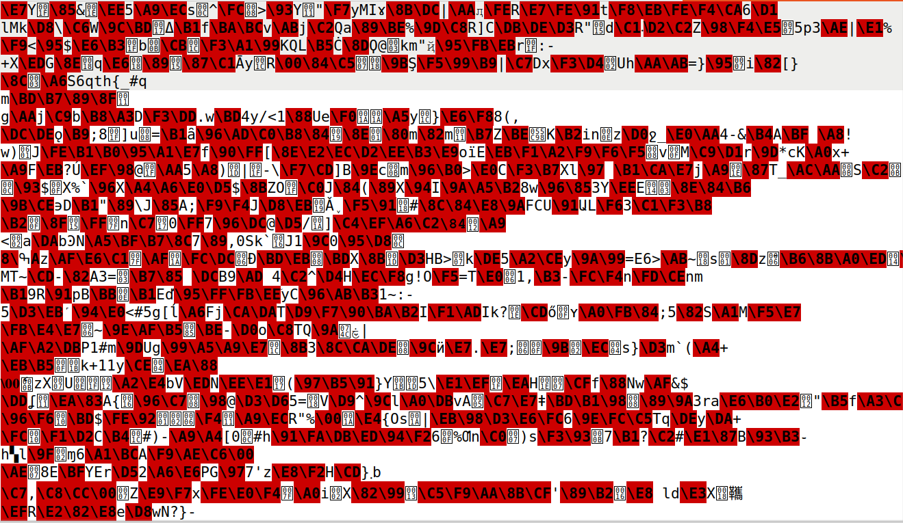

# This week's practical classes

## Task 1

We were tasked with deciphering a cyphertext file provided using a frequency analysis technique. 

After running the included script to perform said technique, we got these results on the 3-gram frequency.


Based on the information gathered from the wikipedia links included in the guide, we found that the frequency of the `ytn` and `vup` roughly matched the frequency of `the` and `and` respectably, so after substituting both of those using the command `tr ytnvup THEAND < cyphertext.txt > out.txt`, we got these results


From here on, it was a matter of finding nearly completed words and filling in the correct letter substitutions

For example, some words present in the `out.txt` would be `mNTENDED` and `gETlEEN`, so we would know that for those words to make sense, `mgl` would have to be `IBW` respectively. So our process was to analyze the result and find easy to guess letters, suubstitute those letters, and repeat until the whole text was deciphered.

After following this process, the dechipered text was the following:

```
THE OSCARS TURN  ON SUNDAY WHICH SEEMS ABOUT RIGHT AFTER THIS LONG STRANGE
AWARDS TRIP THE BAGGER FEELS LIKE A NONAGENARIAN TOO

THE AWARDS RACE WAS BOOKENDED BY THE DEMISE OF HARVEY WEINSTEIN AT ITS OUTSET
AND THE APPARENT IMPLOSION OF HIS FILM COMPANY AT THE END AND IT WAS SHAPED BY
THE EMERGENCE OF METOO TIMES UP BLACKGOWN POLITICS ARMCANDY ACTIVISM AND
A NATIONAL CONVERSATION AS BRIEF AND MAD AS A FEVER DREAM ABOUT WHETHER THERE
OUGHT TO BE A PRESIDENT WINFREY THE SEASON DIDNT JUST SEEM EXTRA LONG IT WAS
EXTRA LONG BECAUSE THE OSCARS WERE MOVED TO THE FIRST WEEKEND IN MARCH TO
AVOID CONFLICTING WITH THE CLOSING CEREMONY OF THE WINTER OLYMPICS THANKS
PYEONGCHANG

ONE BIG QUESTION SURROUNDING THIS YEARS ACADEMY AWARDS IS HOW OR IF THE
CEREMONY WILL ADDRESS METOO ESPECIALLY AFTER THE GOLDEN GLOBES WHICH BECAME
A JUBILANT COMINGOUT PARTY FOR TIMES UP THE MOVEMENT SPEARHEADED BY 
POWERFUL HOLLYWOOD WOMEN WHO HELPED RAISE MILLIONS OF DOLLARS TO FIGHT SEXUAL
HARASSMENT AROUND THE COUNTRY

SIGNALING THEIR SUPPORT GOLDEN GLOBES ATTENDEES SWATHED THEMSELVES IN BLACK
SPORTED LAPEL PINS AND SOUNDED OFF ABOUT SEXIST POWER IMBALANCES FROM THE RED
CARPET AND THE STAGE ON THE AIR E WAS CALLED OUT ABOUT PAY INEQUITY AFTER
ITS FORMER ANCHOR CATT SADLER QUIT ONCE SHE LEARNED THAT SHE WAS MAKING FAR
LESS THAN A MALE COHOST AND DURING THE CEREMONY NATALIE PORTMAN TOOK A BLUNT
AND SATISFYING DIG AT THE ALLMALE ROSTER OF NOMINATED DIRECTORS HOW COULD
THAT BE TOPPED

AS IT TURNS OUT AT LEAST IN TERMS OF THE OSCARS IT PROBABLY WONT BE

WOMEN INVOLVED IN TIMES UP SAID THAT ALTHOUGH THE GLOBES SIGNIFIED THE
INITIATIVES LAUNCH THEY NEVER INTENDED IT TO BE JUST AN AWARDS SEASON
CAMPAIGN OR ONE THAT BECAME ASSOCIATED ONLY WITH REDCARPET ACTIONS INSTEAD
A SPOKESWOMAN SAID THE GROUP IS WORKING BEHIND CLOSED DOORS AND HAS SINCE
AMASSED  MILLION FOR ITS LEGAL DEFENSE FUND WHICH AFTER THE GLOBES WAS
FLOODED WITH THOUSANDS OF DONATIONS OF  OR LESS FROM PEOPLE IN SOME 
COUNTRIES


NO CALL TO WEAR BLACK GOWNS WENT OUT IN ADVANCE OF THE OSCARS THOUGH THE
MOVEMENT WILL ALMOST CERTAINLY BE REFERENCED BEFORE AND DURING THE CEREMONY 
ESPECIALLY SINCE VOCAL METOO SUPPORTERS LIKE ASHLEY JUDD LAURA DERN AND
NICOLE KIDMAN ARE SCHEDULED PRESENTERS

ANOTHER FEATURE OF THIS SEASON NO ONE REALLY KNOWS WHO IS GOING TO WIN BEST
PICTURE ARGUABLY THIS HAPPENS A LOT OF THE TIME INARGUABLY THE NAILBITER
NARRATIVE ONLY SERVES THE AWARDS HYPE MACHINE BUT OFTEN THE PEOPLE FORECASTING
THE RACE SOCALLED OSCAROLOGISTS CAN MAKE ONLY EDUCATED GUESSES

THE WAY THE ACADEMY TABULATES THE BIG WINNER DOESNT HELP IN EVERY OTHER
CATEGORY THE NOMINEE WITH THE MOST VOTES WINS BUT IN THE BEST PICTURE
CATEGORY VOTERS ARE ASKED TO LIST THEIR TOP MOVIES IN PREFERENTIAL ORDER IF A
MOVIE GETS MORE THAN  PERCENT OF THE FIRSTPLACE VOTES IT WINS WHEN NO
MOVIE MANAGES THAT THE ONE WITH THE FEWEST FIRSTPLACE VOTES IS ELIMINATED AND
ITS VOTES ARE REDISTRIBUTED TO THE MOVIES THAT GARNERED THE ELIMINATED BALLOTS
SECONDPLACE VOTES AND THIS CONTINUES UNTIL A WINNER EMERGES

IT IS ALL TERRIBLY CONFUSING BUT APPARENTLY THE CONSENSUS FAVORITE COMES OUT
AHEAD IN THE END THIS MEANS THAT ENDOFSEASON AWARDS CHATTER INVARIABLY
INVOLVES TORTURED SPECULATION ABOUT WHICH FILM WOULD MOST LIKELY BE VOTERS
SECOND OR THIRD FAVORITE AND THEN EQUALLY TORTURED CONCLUSIONS ABOUT WHICH
FILM MIGHT PREVAIL

IN  IT WAS A TOSSUP BETWEEN BOYHOOD AND THE EVENTUAL WINNER BIRDMAN
IN  WITH LOTS OF EXPERTS BETTING ON THE REVENANT OR THE BIG SHORT THE
PRIZE WENT TO SPOTLIGHT LAST YEAR NEARLY ALL THE FORECASTERS DECLARED LA
LA LAND THE PRESUMPTIVE WINNER AND FOR TWO AND A HALF MINUTES THEY WERE
CORRECT BEFORE AN ENVELOPE SNAFU WAS REVEALED AND THE RIGHTFUL WINNER
MOONLIGHT WAS CROWNED

THIS YEAR AWARDS WATCHERS ARE UNEQUALLY DIVIDED BETWEEN THREE BILLBOARDS
OUTSIDE EBBING MISSOURI THE FAVORITE AND THE SHAPE OF WATER WHICH IS
THE BAGGERS PREDICTION WITH A FEW FORECASTING A HAIL MARY WIN FOR GET OUT

BUT ALL OF THOSE FILMS HAVE HISTORICAL OSCARVOTING PATTERNS AGAINST THEM THE
SHAPE OF WATER HAS  NOMINATIONS MORE THAN ANY OTHER FILM AND WAS ALSO
NAMED THE YEARS BEST BY THE PRODUCERS AND DIRECTORS GUILDS YET IT WAS NOT
NOMINATED FOR A SCREEN ACTORS GUILD AWARD FOR BEST ENSEMBLE AND NO FILM HAS
WON BEST PICTURE WITHOUT PREVIOUSLY LANDING AT LEAST THE ACTORS NOMINATION
SINCE BRAVEHEART IN  THIS YEAR THE BEST ENSEMBLE SAG ENDED UP GOING TO
THREE BILLBOARDS WHICH IS SIGNIFICANT BECAUSE ACTORS MAKE UP THE ACADEMYS
LARGEST BRANCH THAT FILM WHILE DIVISIVE ALSO WON THE BEST DRAMA GOLDEN GLOBE
AND THE BAFTA BUT ITS FILMMAKER MARTIN MCDONAGH WAS NOT NOMINATED FOR BEST
DIRECTOR AND APART FROM ARGO MOVIES THAT LAND BEST PICTURE WITHOUT ALSO
EARNING BEST DIRECTOR NOMINATIONS ARE FEW AND FAR BETWEEN
```


## Task 2

For this one, we were tasked to encrypt the plain text file we deciphered using different ciphers and the `openssl enc` command. We decided to use three different ciphers: `aes-128-cbc`, `bf-cbc` & `aes-128-cfb`. This is the results we obtained when trying to open the encrypted file as a text file: 

Using `aes-128-cbc`


Using `bf-cbc`


Using `aes-128-cfb`
 


As we can see, despite using the same key and initialization vector values, the results were drasticaly different from one encrypted file to another, just by using different ciphers.


## Task 3

In this one, we were tasked with encrypting a `.bmp` file using two different encryption modes: Electronic code book (ECB) and Cypher block chaning (CBC)

This was the image we were to encrypt


After using the ECB mode, we got this result


After using the CBC mode, we got this result


As we can see, by using the second encryption mode, CBC, we can no longer tell what the image resembles, as it is completely scrambled. But, after using the first encryption mode, ECB, we can still figure out what the image was supposed to represent, despite not being as detailed or with the correct colors.

This is because ECB is a form of encryption that divides the file into blocks of bytes of a fixed length and encrypts them seperately. So, by using the same key for each block, and since each block is independent, we see patterns showing up in the encrypted file, which can be strong indications of what the original file was meant to represent. Using the image files, it is easy to visualize this.

However, the second encryption mode, CBC, uses an initialization vector and XORs it into the data blocks before being encrypted. Then, that same encrypted data is used to perform the same function as the IV to the next block (the next block, before being encrypted, will be XORed using the previous block's encrypted result.) and so on until the file is complete. This will create a chain of encryption that will guarantee that the next code block, even if it represents the same pattern of  data as the previous one, will have a completely different encrypted state than the previous one. This is also easily visualized in the images showed previously, as the encrypted file is completely unrecognizable.


# This week's CTF

For this week, our challenge was to decipher a piece of cyphertext provided by the server, which was encrypted using a poor optimization techinque which allowed for an attack to decipher the data easily.


After analyzing the code, we found that the key used to encrypt the plaintext, despite being 16 bytes long, the first 13 bytes were just `0x00`, while the last 3 bytes were randomly chosen.


With this knowledge, we realized that performing a brute-force attack was possible, by iterating through all possible combinations of the last three bytes of the key and appending 13 `0x00` to the beggining of each combination. The server provided us with the cyphertext, along with the `nonce` value, so all we had to do was try different keys until one deciphered the text.

We knew the deciphered text would be the flag, so everytime we decrypted the ciphertext with a key, a check would occur to figure out if the first 4 characters for the decrypted text were `flag`, and if so, we would print the text and stop the program.

This is the code we used to perform the attack, using the provided cyphertext `00ffe6d70bf5946ca3d02849544f727149f789bb9699539f7022da20b4b8fbbebed6d2a1d66999` and nonce `3cf3da2b2db82e5df08bce1e38f48374`


After about 50 seconds of running this program, we got our flag.


