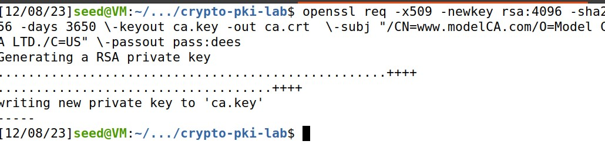
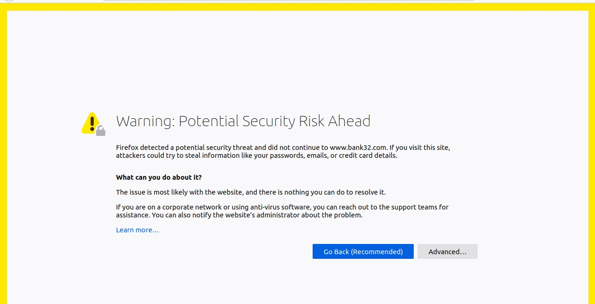
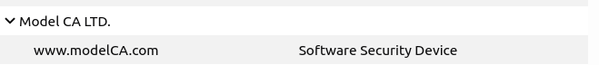
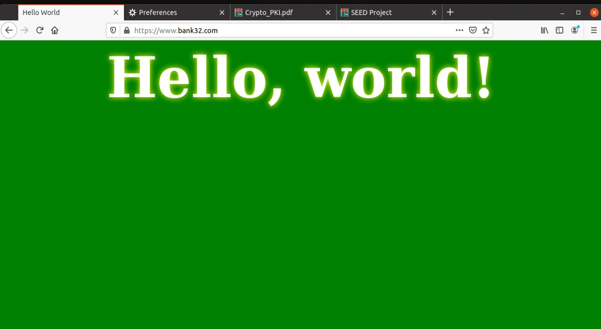
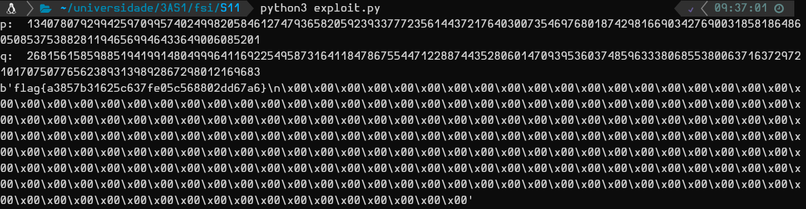

# PKI Lab

### Task 1 - Becoming a Certificate Authority (CA)

In this task we are asked to create and configure a directory following a provided structure.

After we did this we ran the command that is in the lab to generate the self-signed certificate for the CA:

`openssl req -x509 -newkey rsa:4096 -sha256 -days 3650 \-keyout ca.key -out ca.crt  \-subj "/CN=www.modelCA.com/O=Model CA LTD./C=US" \-passout pass:dees`




- Which part of the certificate indicates this is a CA's certificate? 

The `CA: TRUE` line in the X509v3 extensions:

```
X509v3 extensions:
            X509v3 Subject Key Identifier: 
                59:0D:9C:C8:04:08:17:15:02:BD:03:4C:B1:38:4B:19:28:00:EB:B6
            X509v3 Authority Key Identifier: 
                keyid:59:0D:9C:C8:04:08:17:15:02:BD:03:4C:B1:38:4B:19:28:00:EB:B6

            X509v3 Basic Constraints: critical
                CA:TRUE
```

- What part of the certificate indicates this is a self-signed certificate?

To determine if a certificate is self-signed, we need to look at the "Issuer" and "Subject" fields in the certificate details. In a self-signed certificate, the issuer and subject are the same, meaning the certificate is issued by the entity it represents.

```
Issuer: CN = www.modelCA.com, O = Model CA LTD., C = US
Subject: CN = www.modelCA.com, O = Model CA LTD., C = US
```

-  In the RSA algorithm, we have a public exponent e, a private exponent d, a modulus n, and two secretnumbers p and q, such that n = pq.  Please identify the values for these elements in your certificateand key files.

public exponent e:

`65537 (0x10001)`

private exponent d:

```
00:c0:24:f3:f5:9f:80:be:2c:4f:a7:98:e6:47:b1:
db:96:43:98:a8:90:8e:3c:a3:29:05:41:f0:32:78:
63:2b:5d:08:3a:c9:46:41:7f:6d:dd:b3:ce:54:9f:
d4:19:26:b7:a8:c2:da:d1:06:d5:19:e8:d1:31:3e:
8a:73:18:12:f7:7d:ad:fb:35:3d:1d:9e:ef:b7:91:
fd:c7:7c:94:3a:9b:77:e3:cf:fe:e9:48:aa:fb:67:
0f:2b:cb:20:97:ee:a0:6c:1e:f3:47:b3:5e:1b:69:
91:a0:56:7d:0d:65:47:d3:5f:3d:21:02:2a:18:62:
7c:d1:d8:ef:9c:35:ae:45:55:38:4b:b5:ec:a4:e8:
43:df:79:ad:ee:91:e5:2b:76:bb:d5:6e:29:3d:79:
42:d3:73:9c:38:46:01:2a:af:23:46:1f:0f:17:21:
d1:a5:81:8a:44:f3:8d:88:ff:d0:3e:68:9e:da:73:
b1:86:d9:7c:d3:0a:1e:82:46:33:71:ca:8a:19:31:
08:2a:22:9a:05:f0:8f:d5:dc:f1:95:1e:ee:6e:bd:
e0:06:9c:c3:51:cc:9e:f8:63:70:03:88:f1:a3:93:
3f:6f:44:18:ba:ec:78:6d:a3:24:96:c8:cb:5a:07:
06:06:ec:d4:b5:b2:76:66:15:83:d7:df:5a:00:f7:
7b:e6:77:d9:84:f0:ba:91:b0:b9:db:aa:38:78:06:
99:85:3e:8b:8d:95:ba:79:aa:44:52:4f:c6:14:d8:
44:43:27:58:8c:ed:9f:22:52:ae:3f:c4:17:72:67:
d0:fe:88:be:0b:30:92:58:30:07:ee:ba:da:30:8d:
f1:17:23:de:55:0c:94:cd:9c:44:b4:bc:e3:ed:75:
09:50:55:9b:1b:52:ac:8f:a3:89:41:cb:39:df:4b:
21:b1:14:96:08:f3:c1:7d:7c:85:b7:dc:80:9d:df:
5a:50:50:78:93:67:86:2e:f6:25:35:ba:12:2e:74:
64:46:5c:81:48:c6:a7:4b:75:f3:d3:c8:7d:56:fd:
aa:a1:46:7c:0c:b0:98:0c:8c:93:49:11:c8:c0:6a:
3b:40:88:00:13:dc:6b:76:e9:39:a7:18:51:d4:15:
b7:8d:f8:d6:6f:b9:1c:59:82:bb:1a:8e:8d:c5:20:
14:f3:e1:15:01:32:c2:20:55:f9:f8:b2:41:65:3f:
ff:4a:d6:d3:56:98:66:17:34:94:5b:47:bb:c8:83:
c3:5e:79:7d:6e:37:42:be:0d:5c:09:9a:57:5c:7d:
94:7c:e2:d7:63:87:9a:a9:be:b4:af:05:06:35:d3:
bb:bb:0b:39:d0:01:2d:7e:2b:63:60:ea:7d:84:15:
a2:b9:c1
```

modulus n:

```
00:c9:67:58:02:0b:85:f1:9b:ba:0c:e8:6c:7d:07:
2b:a5:a8:3e:6a:86:8d:ea:f1:a8:f0:13:9c:2d:f5:
4f:e3:b3:3c:6a:a8:66:5f:3e:48:26:00:cd:79:fd:
72:b2:76:8b:91:97:7d:fa:13:f9:1f:d8:9b:a1:23:
a2:fb:36:2f:97:83:4a:2d:a4:38:7b:68:01:02:61:
bb:38:3b:fd:8a:3e:36:78:25:7b:bd:24:fb:61:bb:
f1:dc:80:a6:04:5a:70:6d:88:14:77:74:17:b5:bd:
fc:56:d5:c8:b1:26:9f:a7:10:b0:e1:5a:ba:95:d7:
91:80:3e:a2:63:c3:0d:64:96:fe:27:33:71:9f:af:
b8:3b:57:c1:ed:f3:78:50:f4:62:a4:c4:97:b4:8a:
b0:0c:03:cc:5c:50:5a:dd:c9:c8:0a:e2:64:e1:19:
56:e9:eb:65:5b:00:84:94:6f:cc:a1:d9:1b:ac:ae:
3e:0c:97:26:07:fc:ed:65:83:0f:bd:2b:b1:fd:ea:
9d:c3:59:29:31:31:5e:a3:ed:7d:ac:b4:7f:36:68:
73:b5:e4:e2:ec:76:0d:be:ba:72:0c:d8:13:71:45:
99:e9:61:65:f2:7e:49:2f:2a:82:5f:dd:49:ba:45:
ff:a1:9c:4e:b0:5a:0f:b9:8f:21:f9:1a:08:28:4b:
96:32:d3:53:59:fe:09:1a:dd:3f:dc:ab:34:63:17:
ae:72:0a:b7:77:80:6e:2a:93:e2:69:5c:26:84:91:
39:09:a5:f5:0a:ea:44:6f:fb:65:51:b8:ee:38:90:
6b:f0:e4:84:e3:01:71:18:16:f8:46:8d:e5:f2:b9:
f2:a2:41:06:3d:cd:e4:01:3a:d9:b6:9f:c4:08:26:
4a:21:a4:1e:2f:43:73:eb:bd:17:61:08:f4:d3:f5:
8d:ae:6d:76:89:92:ce:14:f6:67:d9:5b:1b:d8:fa:
bc:4b:ef:c9:5b:ed:d2:9d:48:b9:c3:81:65:5b:b5:
93:1b:03:69:a0:76:96:1c:43:33:f3:04:57:a6:08:
4a:e4:f0:51:00:68:51:f9:a1:a1:36:6c:ac:49:ed:
2d:df:ad:d7:14:bd:74:81:8d:da:9a:63:76:30:0d:
00:a2:7a:3d:1f:c8:4b:b3:fc:57:f2:4c:5e:aa:ed:
6f:28:2e:38:1c:18:8d:3e:bf:a0:4b:e0:7d:35:0d:
d6:19:03:91:df:1a:6e:28:aa:0f:bd:e7:8a:55:7e:
e4:a9:3e:af:87:cf:ca:06:01:b2:57:41:af:83:f5:
6b:05:5d:38:38:1a:7d:82:e2:7a:d1:13:03:a1:68:
01:c1:48:67:6c:8c:5d:3d:d8:e2:2b:36:43:af:09:
0b:8b:97
```

secret number p (prime1) :

```
00:eb:f6:d4:62:6c:b7:b4:50:38:d5:4d:c7:23:a3:
3a:e6:a1:e4:e7:9b:e3:2b:ed:bf:26:fd:f9:16:e4:
41:3c:ac:c1:c2:59:9e:76:f2:17:2d:ba:07:00:b4:
39:0f:d7:4c:e2:0a:90:6d:fc:d8:7f:09:e7:c6:ad:
ba:a5:d9:4c:7d:91:df:cc:2b:1c:57:13:9f:8d:25:
5d:bb:7a:af:46:e8:60:11:0a:2b:97:dc:10:9e:a1:
1d:ad:08:31:47:96:11:71:86:b8:1f:92:56:43:69:
b9:fe:21:2f:db:6d:60:a4:16:0a:80:e2:61:c2:1a:
24:f1:01:bb:cb:81:46:db:9a:9a:95:ca:0b:5d:bb:
c2:b3:ff:9a:a7:5a:7e:78:1c:59:4e:ce:a5:0d:9c:
0c:96:11:78:72:1c:1f:d6:da:29:13:9e:7d:88:e2:
b6:09:01:55:06:d0:06:75:5b:0d:3b:47:22:01:66:
2b:53:c6:a0:7f:86:7f:11:3d:33:22:2c:73:39:dc:
e4:be:72:47:8e:11:68:1e:cc:a7:55:bd:5e:6f:11:
bb:46:3d:f8:e0:31:d7:2a:f1:8c:94:37:09:75:98:
41:5f:d1:90:17:2b:77:d4:de:36:80:ff:dc:78:29:
fa:c3:cb:68:00:09:57:7b:c3:fc:32:38:f5:68:8e:
2c:79
```

secret number q (prime2) :

```
00:da:81:45:2f:63:94:5c:87:19:75:bf:29:97:70:
1a:4c:ae:6c:df:b4:32:10:18:f8:cd:cc:0a:7e:67:
9a:6c:9b:b6:73:ae:27:d6:3c:f1:64:2d:d4:2d:bf:
a6:d2:d7:66:24:42:26:e4:0e:59:eb:1e:9e:df:8b:
2d:52:78:07:da:9b:4c:17:86:d9:8f:95:e2:2a:80:
36:79:aa:64:23:19:44:d2:5a:fb:26:ca:dc:3e:f5:
9f:16:d7:ec:fa:cf:84:d4:48:24:e0:2e:29:92:85:
64:38:ed:d7:ec:3a:98:74:89:99:c9:fd:98:19:9f:
13:c7:22:a4:9d:85:35:74:71:29:ef:29:a7:33:02:
f6:13:a5:8c:ae:53:6b:bf:8a:1d:3f:55:9a:0d:43:
ca:33:ec:36:9e:94:5c:0f:cc:a3:7c:30:8b:75:04:
a3:3f:ac:45:97:29:ae:27:46:25:a3:25:a3:2a:fb:
86:7f:e7:58:06:be:50:58:58:74:e2:2c:90:7e:1e:
88:a3:a9:bb:6e:d4:9b:17:f6:fb:44:7c:3d:03:4b:
a3:f8:f3:a1:9e:bb:d9:26:78:a2:c1:61:c8:a6:5f:
57:7d:81:9e:e5:0b:a5:70:b4:0c:b3:1b:ea:2b:fd:
e8:64:31:c7:59:49:e5:4f:dc:ab:eb:c2:9a:7f:11:
54:8f
```

### Task 2 - Generating a Certificate Request for Your Web Server

In this task we are asked to create a certificate request for our webserver (bank32.com) and also add alernative names (URLs) to that certificate. For that we run the following command:

`openssl req -newkey rsa:2048 -sha256  \-keyout server.key   -out server.csr  \-subj "/CN=www.bank32.com/O=Bank32 Inc./C=US" \-passout pass:dees -addext "subjectAltName = DNS:www.bank32.com,  \DNS:www.bank32A.com, \DNS:www.bank32B.com"`

With this, we added two alternative names to the certificate signing request: www.bank32A.com and www.bank32B.com.

### Task 3 - Generating a Certificate for your server

In this task we will be converting the signing request into a certificate with our CA. For that we run the following command:

`openssl ca -config openssl.cnf -policy policy_anything \-md sha256 -days 3650 \-in server.csr -out server.crt -batch \-cert ca.crt -keyfile ca.key`

After this, we are asked to print out the decoded content of the certificate and check whether the alternative names are included.

We can verify that information in the following lines of the certificate:

```
X509v3 Subject Alternative Name: 
                DNS:www.bank32.com, DNS:www.bank32A.com, DNS:www.bank32B.com
```

### Task 4 - Deploying Certificate in an Apache-Based HTTPS Website

In this task we are asked to deploy the apache server to run our website.

To do this we start a shell in the running container and type the following command:

`service apache2 start`

Before that, we have to configure apache to use the server certificate and key that we generated and signed in the previous tasks. 

For this, we replaced the default bank32.crt and bank32.key files that were already in the certs folder.

`cp /home/seed/Desktop/crypto-pki-lab/server.crt ./bank32.crt`

`cp /home/seed/Desktop/crypto-pki-lab/server.key ./bank32.key`

After starting the server with these configurations, we are able to browse to the website:



We are warned about a Potential Security Risk by the browser (Firefox), this is because this website doesn't have a valid certificate accepted by firefox:

`Websites prove their identity via certificates. Firefox does not trust www.bank32.com because its certificate issuer is unknown, the certificate is self-signed, or the server is not sending the correct intermediate certificates.`

To fix this, we need to add your CA as an Authority in firefox. For this we go 'Privacy & Security' preferences, then 'View Certificates', then 'Authorities' and import the **ca.crt** file that we generated in the previous tasks. After adding it, we can verify that our Authority is now added to firefox:



Now we can browse to bank32.com without getting any warning:



###  Task 5 - Launching a Man-In-The-Middle Attack

# This week's CTF

In this week we were tasked to decrypt the flag encrypted with RSA encryption.

When we ran the command `nc ctf-fsi.fe.up.pt 6004`, we were given the `n` for the ciphertext, as well as the public exponent `e`.

We also know that the values of `p` and `q` will be around `2^512` and `2^513` respectively, which makes a brute-force attack viable to use.

Our process will then be to create 2 lists of primes close to `p` and `q` within a certain `delta` of distance to their respective powers of 2, then afterwards calculate the `d` value used in the RSA encryption formula `ed % (p-1)(q-1) = 1` by calculating the modular inverse using the extended greatest common denominator algorithm. To finish, we will use the included decrypting function `dec` with a few changes in order to test all the calculated values until the plaintext is readable and starts with "flag".

To achieve this, we developed a few functions:

### testPrime(n)

```python
def testPrime(n):
    if n == 2 or n == 3:
        return True

    if n <= 1 or n % 2 == 0:
        return False

    r, d = 0, n - 1
    while d % 2 == 0:
        r += 1
        d //= 2

    for _ in range(5):
        a = random.randrange(2, n - 1)
        x = pow(a, d, n)
        if x == 1 or x == n - 1:
            continue
        for _ in range(r - 1):
            x = pow(x, 2, n)
            if x == n - 1:
                break
        else:
            return False
    return True
```

### findD(e, p, d) and the necessary functions

```python
def extended_gcd(a, b):
    if a == 0:
        return b, 0, 1
    else:
        g, x, y = extended_gcd(b % a, a)
        return g, y - (b // a) * x, x

def modinv(a, m):
    g, x, y = extended_gcd(a, m)
    if g != 1:
        return None
    else:
        return x % m

def findD(e, p ,q):
   return modinv(e, (p-1)*(q-1))
```

### dec(msg, d, n)

```python
def dec(msg, d, n):
    int_msg = int.from_bytes(unhexlify(msg), "little")
    res = pow(int_msg,d,n)
    return res.to_bytes(256, 'little')
```

### Main loop

This is the loop to find primes close to `p` and `q`, and the main brute-force decryption to test

```python
list_of_p_primes= []
for i in range(2**512 - 10000, 2**512 + 10000):
    if testPrime(i):
        list_of_p_primes.append(i)

list_of_q_primes= []
for i in range(2**513 - 10000, 2**513 + 10000):
    if testPrime(i):
        list_of_q_primes.append(i)

for p in list_of_p_primes:
    for q in list_of_q_primes:
        if p * q == n:
            print("p: ", p)
            print("q: ", q)
            d = findD(65537, p, q)
            res = dec(unhexlify(msg), d, n)
            if res[:4] == b"flag":
                print(res)
                exit()
```

For the msg value of `3066643239656336303839353539303064303761376566636462313165616137313330356439633165623662633731636536653938386662373639366563623032656433316231663439333335636664303063323963666533366433386236323366386261616663313366633763623736616330353763636136396363313262386661303034306334653631316639626631613933336331343935666437653639306262356138636631636338643462393961383364326230373839633637373131333435313332633332663963333266393833373430643231626538646231623864383737313161333263383039656135613561643661643939323066363930313030303030303030303030303030303030303030303030303030303030303030303030303030303030303030303030303030303030303030303030303030303030303030303030303030303030303030303030303030303030303030303030303030303030303030303030303030303030303030303030303030303030303030303030303030303030303030303030303030303030303030303030303030303030303030303030303030303030303030303030303030303030303030303030303030303030303030303030303030303030303030303030303030303030303030303030303030303030303030303030303030303030303030303030303030`, n value of `359538626972463181545861038157804946723595395788461314546860162315465351611001926265416954644815072042240227759742786715317579537628833244985694861278997871052684504401596494019122799039009989371808178352060966438579515613360227960308969957859170183912581829276320781354104234997246446865042463594219967161283` and public exponent value of `65537`, we got the flag in about 11 seconds:



