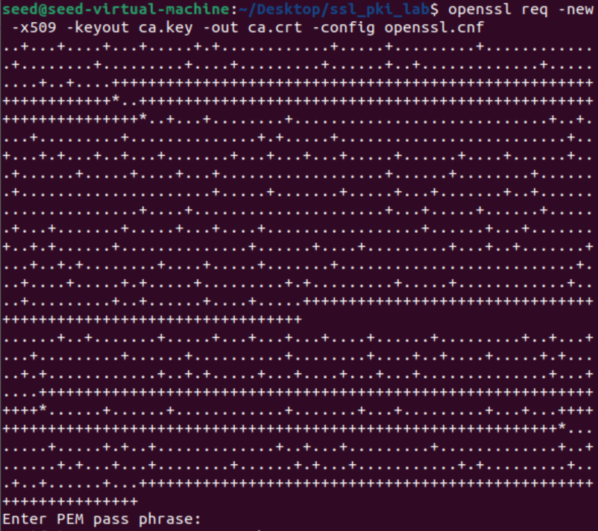
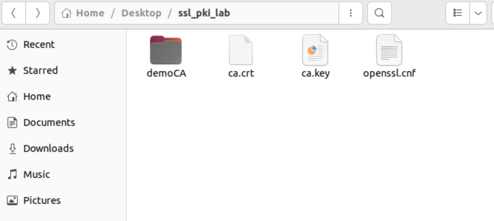

## PKI Lab

# Task 1 - Becoming a Certificate Authority (CA)

In this task we are asked to create and configure a directory following a provided structure.

After we did this we ran the command that is in the lab to generate the self-signed certificate for the CA:

`openssl req -new -x509 -keyout ca.key -out ca.crt -config openssl.cnf`

We get asked to choose a passphrase and we chose `dees`. After configuration the other fields that are required we end up with the following directory structure at the end of this task.

