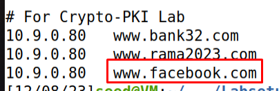

# PKI Lab

### Task 1 - Becoming a Certificate Authority (CA)

In this task we are asked to create and configure a directory following a provided structure.

After we did this we ran the command that is in the lab to generate the self-signed certificate for the CA:

`openssl req -new -x509 -keyout ca.key -out ca.crt -config openssl.cnf`

We get asked to choose a passphrase and we chose `dees`. After configuration the other fields that are required we end up with the following directory structure at the end of this task.

### Task 2 - Creating a Certificate for SEEDPKILab2020.com

- Step 1 : We run the command `openssl genrsa -aes128 -out server.key 1024` to generate an RSA key pair (public and private keys).

- Step 2 : We run the command `openssl req -new -key server.key -out server.csr -config openssl.cnf` to generate a Certificate Signing Request (CSR) and we get a `server.csr` file in our directory.

- Step 3 : We run the command `openssl ca -in server.csr -out server.crt -cert ca.crt -keyfile ca.key \-config openssl.cnf` to turn the signing request into a signature. 

We get an error saying the organization info doesn't match.
To fix this we changed the policy in the configuration file from `policy_match`to `policy_anything`.
After this change we are able to sign the request:

### Task 3 - Deploying Certificate in an HTTPS Web Server

- Step 1 : In this step we just mapped the SEEDPKILab2020.com to our localhost in the /etc/hosts file.

- Step 2 : In this step we are asked to configure the web server using the openssl `s_server` command.
First we copy the secret key and the certificate into one file and we run the server using that file.

We ran into an error web trying to serve the server saying that the key is too small:

To fix this, we genearted the key and signed the certificate again, but this time used 2048 bits instead of the 1024 suggested by the lab. And now we were able to run the server:

