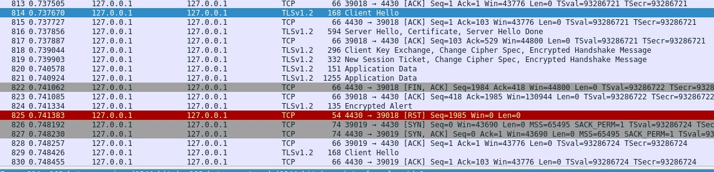
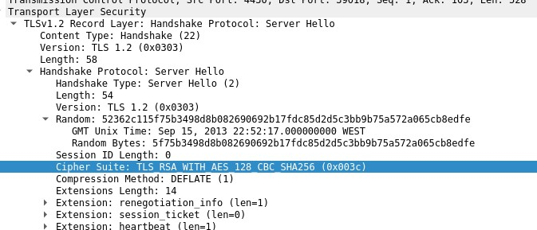

# Sniffing Spooning Lab

### Task 1.1 - A

We started by setting up the sniffer.py script inside the attacker container so that we can capture packets. We used ifconfig command to get the interface name for the script.

Then, we ran the script so we are now capturing packets. In one of the other containers we did `ping google.com` and we are capturing packets:


When we run the script wihtout sudo permissions we are not allowed:


### Task 1.1 - B

In this task we are asked to filter packets:

- Capture only the ICMP packets

This is what was already in the provided sniffer.py code so that was what we did in the last task using this code:

`sniff(iface='br-0709a040ff43', filter='icmp', prn=print_pkt)`

- Capture only TCP packets from a specific IP adress.

We changed our sniffer.py script to do this:

`sniff(iface='br-0709a040ff43', filter='tcp and src host 10.9.0.5 and dst port 23', prn=print_pkt)`


- Capture  packets  comes  from  or  to  go  to  a  particular  subnet.   You  can  pick  any  subnet,  such  as128.230.0.0/16;

We changed our sniffer.py script to do this:

`sniff(iface='br-0709a040ff43', filter='net 128.230.0.0/16', prn=print_pkt)`

Then we pinged the subnet and we got the following:


### Task 1.2

To create a spoof packet we used the following code (with an arbitrary source IP address `100.100.100.100`):

```py
from scapy.all import *

a = IP()
a.src = '100.100.100.100'
a.dst = '10.9.0.5'

b = ICMP()
b.id = 0x23
b.seq = 0x1
p = a/b

send(p)
p.show()
```

We can confirm that it received and accepted the packet:


 
### Task 1.3

In this tasked we are asked to traceroute the path between our VM and a destination (we chose google public dns aka 8.8.8.8). For this we coded the following python script:

```py
from scapy.all import *

source = IP()
source.dst = '8.8.8.8'

notArrived = True
ttl = 1

while notArrived:
    source.ttl = ttl
    response = sr1(source/ICMP(), verbose=0, timeout=5)
   
    if response == None:
        print(f"Time Out: {ttl} packet")
    elif response.type == 0:
        print(f"Echo Reply: {ttl} {response.src}")
        notArrived = False
    else:
        print(f"Continuing: {ttl} {response.src}")
    
    ttl = ttl + 1
```

verbose - to not have output 

timeout - to not get stuck

And the output was the following:


As we can see, it took 13 hops to reach the destination.

### Task 1.4

In this task we are asked to Sniff and-then Spoof a packet. The goal is that when the user container machine pings X, the VM machine sends a response packet, so whether X is alive or not, the user container machine will receive a response.

For this we coded the following python script that we used in the VM:

```py 
from scapy.all import *

def spoof_reply(p):
    if (p[2].type == 8): #echo request
        psrc = p[1].src
        pdst = p[1].dst
        seq = p[2].seq
        pid = p[2].id
        load = p[3].load
        
        reply = IP(src=pdst, dst=psrc)/ICMP(type=0, seq=seq, id=pid)/load
        send(reply)
    

p = sniff(iface=['br-0709a040ff43', 'lo'], filter="icmp", prn=spoof_reply)
```

This code checks if there is a ICMP packet request, and builds a reply packet that is the same as the request packet but with src and dest swapped.

We are asked to ping 3 machines from the user container machine:

- ping 1.2.3.4

In the image it is shown a first ping without the script being running in the VM, so we can confirm that, as expected, there is no response from the host. 

The second ping was made with the running script in the VM so, as expected, we got a reply.


- ping 10.9.0.99

This IP is a non-existing host on the LAN so when we try to ping it from the user container machine, no packet actually passes the sniffing filter so there are no responses sent even though the script is running on the VM. This is because the user container machine doesn't know how to reach 10.9.0.99 as there are no information about that in the ARP table.

- ping 8.8.8.8

In the image it is shown a first ping without the script being running in the VM, so we can confirm that, as expected, there is only one response per packet sent.

The second ping was made with the running script in the VM, as the server actually exists, we got a duplicate response on each packet sent.


# This week's CTF

This week, our job was to analyze a .pcapng file and construct a flag based on certain values to be collected by reading the file's contents using `Wireshark`.

To begin, after opening up the file using Wireshark, we needed to find the TLS handshake which used the random number `52362c11ff0ea3a000e1b48dc2d99e04c6d06ea1a061d5b8ddbf87b001745a27` in the `Client Hello` message.

To do this, we can use a filter like the one shown in the picture:


Now that we have located the correct frame for the start of the handshake, we have collected one piece of the flag, the `frame-start` value, which is 814.

Removing the filter and locating frame 814, we see the entire TLS handshake messages, and now we can see the `frame-end` value, which is 819 since it's the frame labeled `New Session Ticket, Change cipher spec, Encrypted Handshake Message` which is the last message in the handshake procedure sent by the Server to the Client.




To get the next piece of the flag, `selected-cipher-suite`, we need to look into the data of the `Server Hello` frame, in which we see the cipher-suite the Server has deemed to be used for encrypted communication. It's value is `TLS_RSA_WITH_AES_128_CBC_SHA256`



By analizing the following frames, labeled `Application Data`, we are able to obtain the fourth value, `total-encrypted-appdata-exchanged`, which is 1264.

Finally, by going back to frame 819, we can see the final value, `size-of-encrypted-message`, which is 80.

Using all of these, we construct the flag, which is:

`flag{814-819-TLS_RSA_WITH_AES_128_CBC_SHA256-1264-80}`