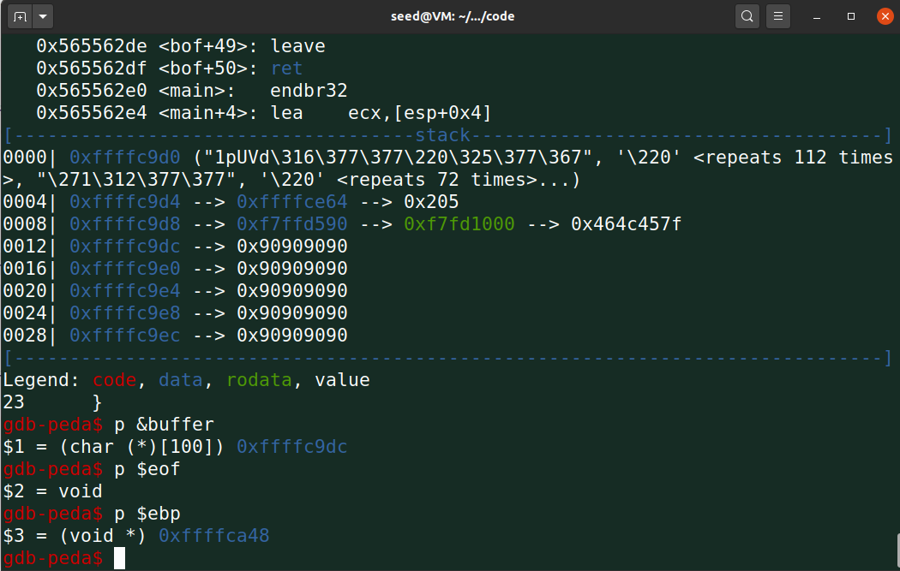
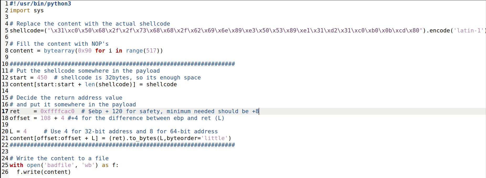
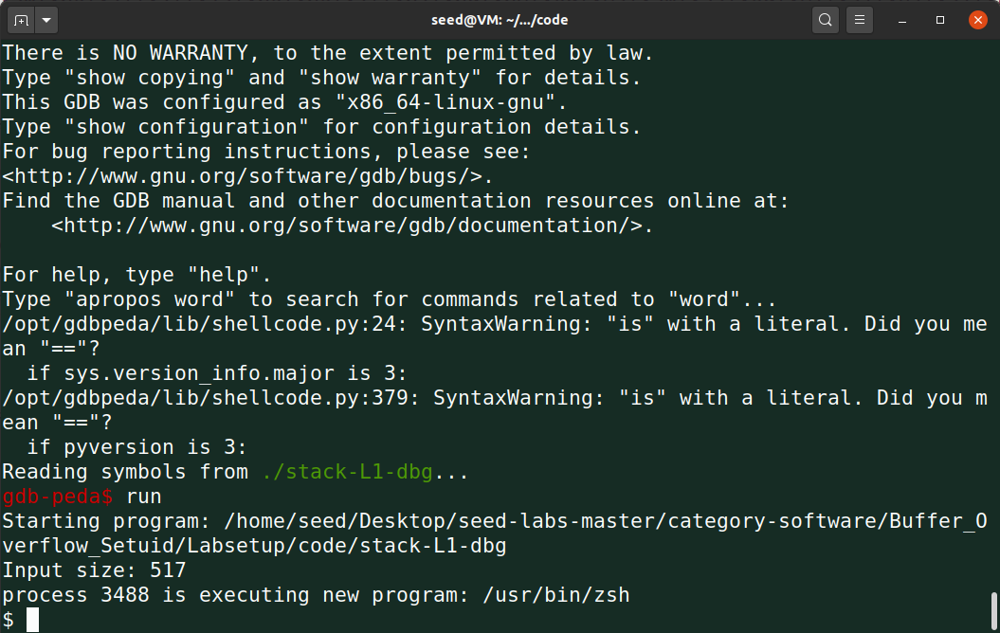
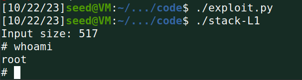
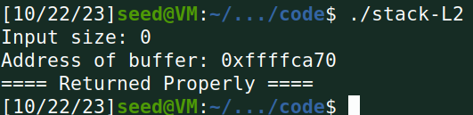
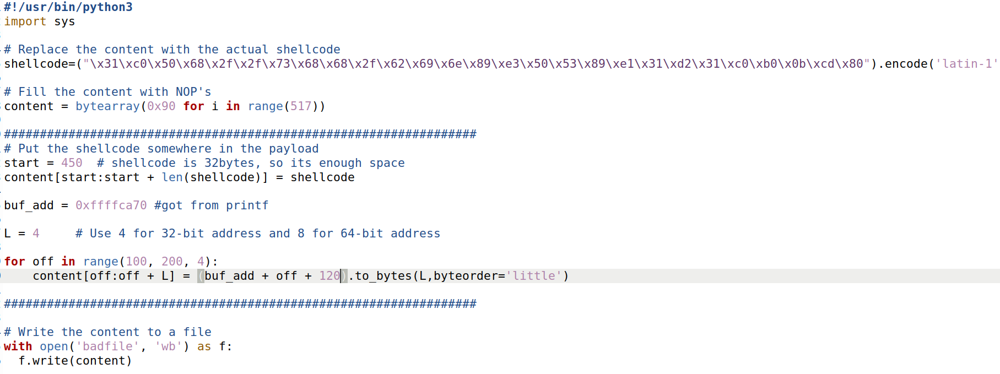
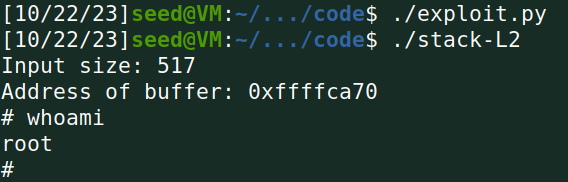

## Practical classes this week

- **Task 1:** Running both versions of the shellcode created a root shell that we could use.

- **Task 2:** Nothing to add, all we were asked to do was to compile the vulnerable program stack.c using the provided Makefile.

- **Task 3:** We were asked to perform and explain a buffer-overflow attack against a program called stack-L1. We first started by creating a file named `badfile` which would be read by the program. After that, using gdb on thr program `stack-L1-dbg`, we were able to visualize the `&buffer` and `$ebp` address values.    With these values, we were able to calculate the offset between the `$ebp` and the `&buffer`, which was 108, and placed it in the `offset` variable in the `exploit.py` script. We also were able to calculate the return address we desired, since we know that the return address in the stack is at an `L` distance from the `$ebp` address, which in our case is 4, plus an extra 8 bytes of space for the actual return address. So, we filled in the `ret` variable in the script with the `$ebp + 120` value. The minimum required should be `+ 8` to the `$ebp` address in order to point to our `nop` sled in our shellcode, but that could lead to some errors in a real world scenario, so we added a more significant value in order to avoid that, since the end result will be the same, the return address will still point to our `nop` sled. We also used the `32-bit` shellcode provided in the previous tasks and decided to set the `start` variable in the script to 450, although we realize that the minimum required would be something like `517 - len(shellcode)`, this also works and leaves some room for error. In the end, our `exploit.py` looked like this:    After running the script, which generated our badfile, and loading the `stack-L1-dbg` with `gdb` and using the command `run`, we got the expected result:    Afterwards, it was time to perform this attack in the `./stack-L1` program, without using `gdb`. We inserted a `printf` statement in the program's `bof` function to print out the buffer address, and after running the program we noticed it was 8 bytes below our previous calculations. So, all we did was subtract 8 to our `ret` variable in our script, run the exploit and run the program `stack-L1`. We got the expected result again:  

- **Task 4:** For this one, we were tasked with performing the same attack, only this time we did not know the exact buffer size. The only information we had was the `&buffer` address, with the `printf` address, and that the buffer size could vary from 100 to 200 bytes in size. We had to create a single badfile that would work for any buffer size. After running the program, we got this output:     Now we knew the buffer address, so we created a variable `buf_add` in our `exploit.py` with the obtained value. For this task, we employed the following strategy: since we know the buffer can be any size from 100 to 200 bytes, we will _spray_ the desired return address in 4 byte increments inside that interval, so that, no matter the buffer size, it will always have a valid return address pointing to our `nop` sled.     In each increment of the `for` loop, we added to the base `buf_add` value the `off` value of the loop, since our desired return address has to be calculated in comparison with the `$ebp` value and that value is equal to `&buffer + buf_size`, meaning that, depending on the buffer size, the `$ebp` value would be higher in the stack, and so would the return address position. We also added `+120` to that value for the same reasons above, in order to avoid errors and ensure a correct pointer to our `nop` sled. After running the `exploit.py`, and the `stack-L2` program, we got the expected result: 

## This week's CTF

- **Challenge 1:** After downloading and analyzing the given source code, we noticed that the program that was being run was using `scanf` to read from the user input and stored it in a `char buffer[32]`, which allowed us to perform a buffer overflow by inputting a string with more than 32 chars. Using a text to hex decoder, we found that `mem.txt => 0x6d656d2e7478740d0a`, and by using `gdb`, we set a breakpoint at the `scanf` function and ran the command `x/40xw &buffer`, which allowed us to view 40 bytes in memory starting at the `&buffer` memory address. After locating that the hex pattern for `mem.txt` was right after the 32nd byte in memory, we realized that we could input a string like `ABCABCABCABCABCABCABCABCABCABCABflag.txt\0` which consists of 32 chars and `flag.txt` right afterwards, which would lead to overwriting `mem.txt` in memory to `flag.txt`. After adding that string to the `r.sendline()` command in our `exploit_example.py` and setting the `DEBUG` value to `False`, the flag was revealed.

- **Challenge 2:** Much like the previous challenge, after analysing the code we realized that it was much the same, the `scanf` function was still being used and the `buffer` was still 32 chars in length. Only this time, a variable `char val[4]` was set to `0xdeadbeef`, and for the `fopen()` function to be ran, the value of `val` needed to be `0xfefc2324` in order to pass the `if` conditional. Following the same principle, we ran the command `x/44xw &buffer` to see 44 bytes in memory, where we then found the pattern of the `val` variable, which appeared in memory _before_ the `mem.txt` pattern. After some thought, and using the hex converter to generate the text value of `0xfefc2324`, which is `þü#$`, we created the input string `ABCABCABCABCABCABCABCABCABCABCAB$#üþflag.txt`, which consists of 32 chars, followed by overwriting the `val` variable with the decoded string written _backwards_ since the `checksec` program revealed it was a little endian system, and then overwriting the `file_name` variable with `flag.txt`, which, when ran using the `exploit_example.py` program after modifing the port to `4000`, revealed the flag.
