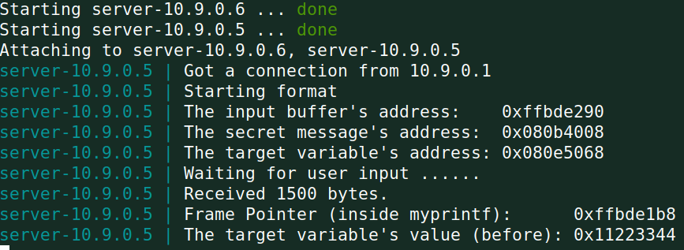
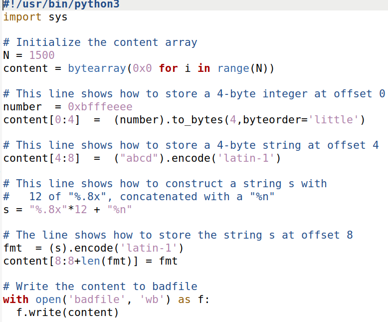
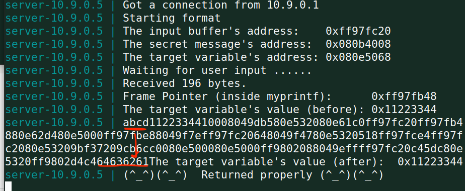
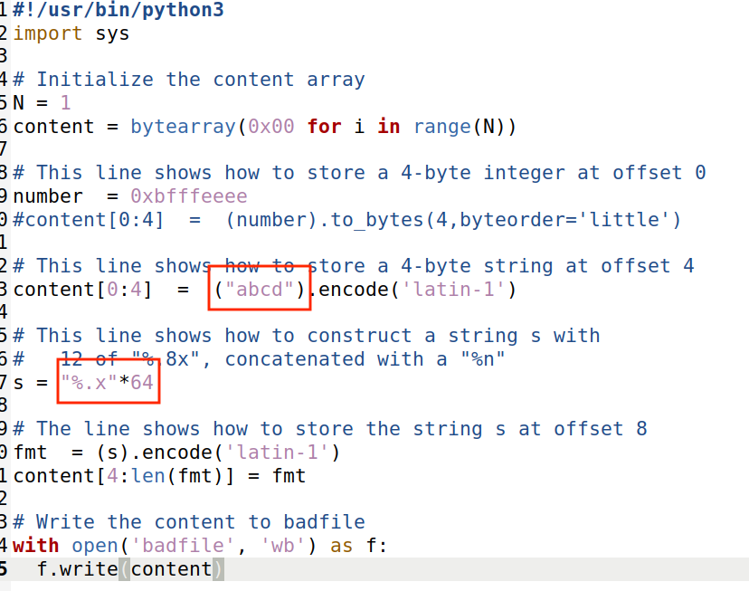
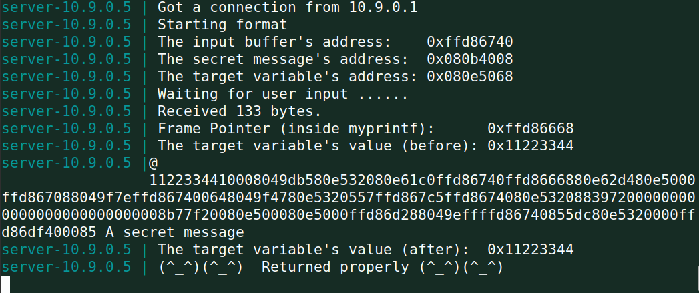
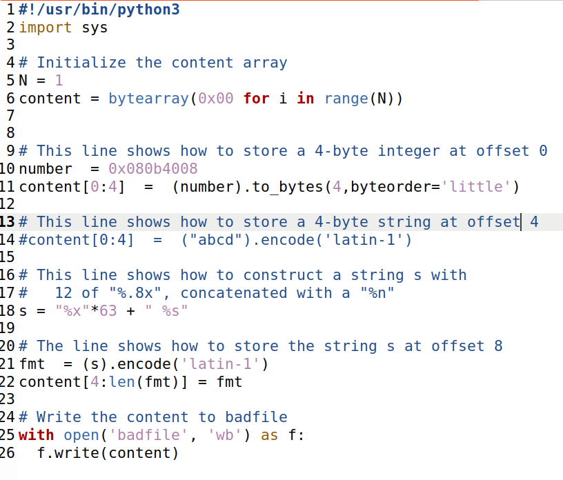
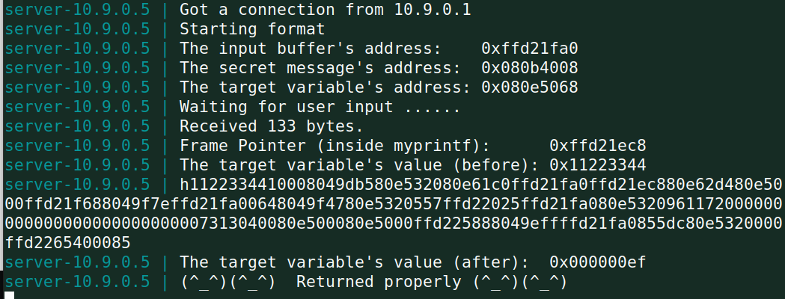
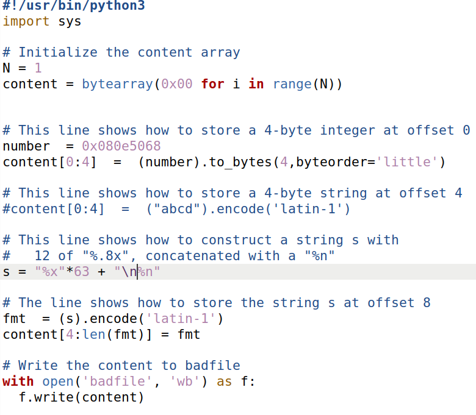
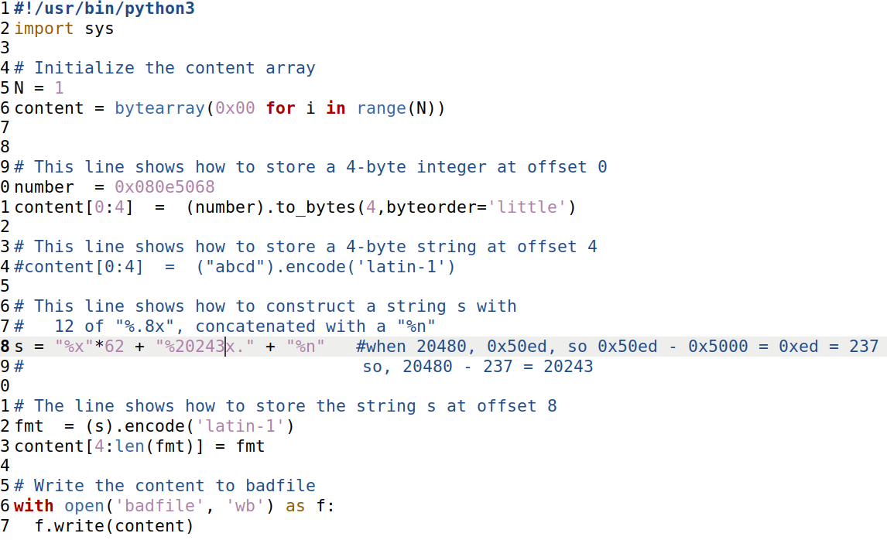

# Practical classes this week

- **Task 1**

 By using the included build_string.py script, without making any changes, we generated a `badfile` containing the built string. When we sent that badfile to the server using `cat badfile | nc 10.9.0.5 9090`, the program crashed.

- **Task 2a**

 By trial and error changing the number of %x, we discovered that the minimum number of %x to get the server program to print out the first four bytes of our input is **64**.

- **Task 2b** 

Using the %s format specifier and not providing an address, it tells the printf statement to read a string from an address present in the stack. In combination with the previous task's knowledge, we can force the %s format specifier to read a string from an address we input into the badfile. So by constructing the format string as the address of the secret variable (0x080b4008), followed by %x * 63 and a %s being the char in the 64th position, it will print out the content of the variable of the inputed address, in this case, the desired secret variable.

- **Task 3a**

Our objective here was to change the target variable's value to anything. By running the program, we were able to obtain the target's address through the output: `0x080e5068`. After some research, we learned we can use the `%n` format specifier to change the variable's value, since it writes to an address in the stack the **number of characters written**. What this means is that, combining the knowledge gained from the previous tasks, we can specify the target's address in the input, use `63*%x` to move the pointer to that same address in the stack _(-1 because we are essentially replacing the %s for %n)_ and use the `%n` format specifier to write the the number of characters written to it. Well, by doing just that, it worked, as can be seen by the program output:

Here is the build_string.py used to achieve this result:

- **Task 3b**

Now our objective has evolved into writing the value `0x5000` into the target variable. By using the previous process, we know we need to write a certain number of characters into our input in order for `%n` to produce the value we desire. Converting 5000 from hexadecimal into decimal, we get `20480`. In order to write 20480 dummy characters without making our input string inconviniently long, we use `%20480x`, which functions as a width specifier for the string, making it so the `printf` function will print out the specified number of characters without having to create a huge input string. By replacing one of the `%x` for the width specifier _(62*%x + %20480x + %n)_ and running the program with that input string, we get that the target variable's value is `0x50ed`, which can be explained by the remaining 62*%x and %n left in the input string. So, by converting the difference between the result value and the desired value (`0xed`), we get `237`. Subtracting the difference from the width specifier, we get `20243`. Now, by using the correct input string, we get the desired result, and the target variable has the correct value:

Here is the build_string.py used to achieve this result:

# This week's CTFs

