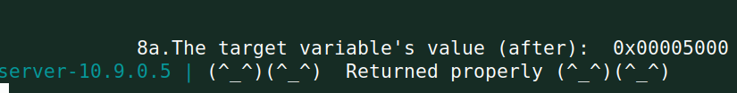

# Practical classes this week

- **Task 1**

 By using the included build_string.py script, without making any changes, we generated a `badfile` containing the built string. When we sent that badfile to the server using `cat badfile | nc 10.9.0.5 9090`, the program crashed.

- **Task 2a**

 By trial and error changing the number of %x, we discovered that the minimum number of %x to get the server program to print out the first four bytes of our input is **64**.

- **Task 2b** 

Using the %s format specifier and not providing an address, it tells the printf statement to read a string from an address present in the stack. In combination with the previous task's knowledge, we can force the %s format specifier to read a string from an address we input into the badfile. So by constructing the format string as the address of the secret variable (0x080b4008), followed by %x * 63 and a %s being the char in the 64th position, it will print out the content of the variable of the inputed address, in this case, the desired secret variable.

- **Task 3a**

Our objective here was to change the target variable's value to anything. By running the program, we were able to obtain the target's address through the output: `0x080e5068`. After some research, we learned we can use the `%n` format specifier to change the variable's value, since it writes to an address in the stack the **number of characters written**. What this means is that, combining the knowledge gained from the previous tasks, we can specify the target's address in the input, use `63*%x` to move the pointer to that same address in the stack _(-1 because we are essentially replacing the %s for %n)_ and use the `%n` format specifier to write the the number of characters written to it. Well, by doing just that, it worked, as can be seen by the program output:

Here is the build_string.py used to achieve this result:

- **Task 3b**

Now our objective has evolved into writing the value `0x5000` into the target variable. By using the previous process, we know we need to write a certain number of characters into our input in order for `%n` to produce the value we desire. Converting 5000 from hexadecimal into decimal, we get `20480`. In order to write 20480 dummy characters without making our input string inconviniently long, we use `%20480x`, which functions as a width specifier for the string, making it so the `printf` function will print out the specified number of characters without having to create a huge input string. By replacing one of the `%x` for the width specifier _(62*%x + %20480x + %n)_ and running the program with that input string, we get that the target variable's value is `0x50ed`, which can be explained by the remaining 62*%x and %n left in the input string. So, by converting the difference between the result value and the desired value (`0xed`), we get `237`. Subtracting the difference from the width specifier, we get `20243`. Now, by using the correct input string, we get the desired result, and the target variable has the correct value:

Here is the build_string.py used to achieve this result:

# This week's CTFs

## Challenge 1

For the first challenge, we were tasked to read the variable `flag` which contained the read flag from a certain file. By analizing the source code, we noticed that the flag was being read in a seperate function named `load_flag`, so, using gdb, we disassembled the function in order to find the address of the `flag` variable.

In the disassembly, we found an address before the `fgets` instruction, indicating that it could be the variable address we need. After inspecting the value, our suspicions were correct.

Now that we have the address we need, it's time to test the stack locally to find out where our input starts. To our surprise, it's address was right after the `printf` address, since it only took one `%x` format specifier in order for our inputed bytes to appear.

Armed with this knowledge, we concluded the `exploit.py` and created our desired input string, which was the variable address in reverse (since the program is little endian), followed by an `%s`, which will load a string from an address in the stack, and since our input is an address and is the first 4 bytes after the `printf`, it will load a string from our input.

Here is the `exploit.py` file.

After running it locally, it was successfull.

So, after changing the `LOCAL` value in the file to False, we got the flag.

## Challenge 2

In this one, after analyzing the source code, we realized it had a backdoor. If a variable `key` (initialized at 0) had a value of `0xbeef`, the program would run a bash shell. So we figured that out task was to change the variable to the desired value in order to gain access to a shell in the system.

We started by disassembling the main function in gdb, where we found the address to the `key` variable. We did this by analyzing where the `cmp` instruction would be because of the `if` statement used in the source code, and saw that `eax` was being compared to our desired value. In the previous instruction (`mov`), eax was getting it's value from `ebx+0x38`.

When we got this value, we used `p $ebx+0x38` in gdb to get the address that equated to that offset. Now we know the target variable's address.

We know from the tasks that to write a value in memory we need to use the `%n` format specifier, which writes to an address in the stack the number of characters printed. So, we decided to convert the desired value into decimal to figure out how many characters needed to be in our input string: `0xbeef = 48879`.

After that, we had to create our input string, so we started by writing the variable's address in reverse at the beginning of our input, followed by a width specifier with `x` as it's format. This is because, after the specified width is written (in our case, the value of the variable), it will print an address in the stack, which would be our inputed address. To finalize, we added `%1$n`, which tells printf to use the first argument for this format specifier (`1$`, our inputed address) and then write the number of characters printed into it (`n`). For this to work however, we used `48875`, which is 4 lesser than our value, because we have to account for the number of bytes in the inputed address, which also count for the number of characters printed.

Here is how our `exploit.py` looked after all these changes.

After testing locally, we were able to activate the backdoor and access the shell.

So, by changing the `LOCAL` variable to False, we were able to access a remote shell in the server. After using `ls`, we saw there was a file named `flag.txt`, so we used `cat` to read it's content and we got the flag.

