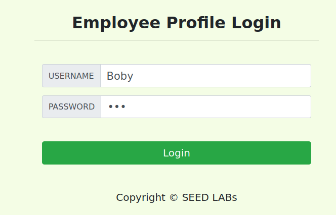
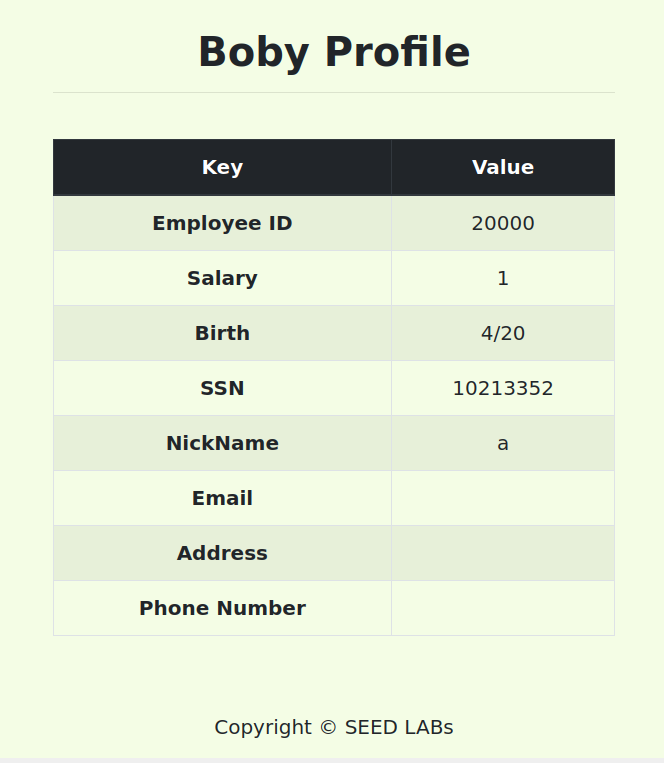
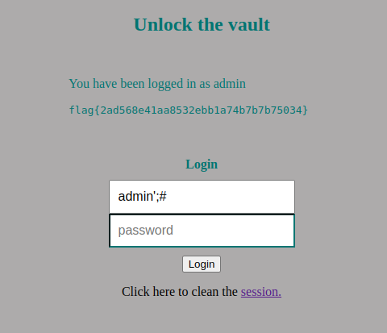

### SQL Injection Lab

- **Task 1**

The goal of this first task is to get familiar with SQL commands.
We started by connecting to this database on the MySQL container:

After this, the goal was to use a SQL command to print all the profile information of the employee Alice.
We started by extracting all the information about this the **credential** table so we knew what the names of the columns were.
We did this with the command **SELECT * FROM credential;**.

Now we know that the row we want to search from is called name, so we did this command to get all the information of the employee Alice:
**SELECT * FROM credential WHERE name = 'Alice';**

- **Task 2.1**

The goal of this task is logging in the admin account, knowing that the usename is admin.

We have access to the authentication code implementation of the website:

We see that they don't use prepare statements, so we can do SQL Injection with the following input:

This input chooses username admin, closes the bracket, ends the statement and comments out the rest of the querry.

When we log in, we see that we have access to all the employee's details:

- **Task 2.2**

The goal of this task was to do the request in the terminal using curl. We encoded the special characters used in the username field and got the following command:

**curl 'http://www.seed-server.com/unsafe_home.php?username=admin'%3B%23&Password='** 

The response contained the table with all employee's information:

- **Task 2.3**

If we were able to run mulitple queries, we could do an input in the username to (for example) delete Alice from the table:

**admin'; DELETE FROM credential WHERE name = 'Alice';#** 

However, this is not possible because of the **mysqli::query()** php method that is used in the code. This method does not allow multiple querries to run in the database server due to security purposes.

- **Task 3.1**

To start doing this task we must log in as Alice (using the same method as before) : **Alice'#;** input in the username field.

When we log in as Alice we see her page, and the option do Edit Profile:

This section allows us to edit some information, and the PHP code is given in the lab:

Our goal is to increase our salary with an SQLi. The payload we got to work was this: **a', salary = 999999999 WHERE Name='Alice';#**

If we didn't include the **WHERE Name='Alice'** part, then it would have changed everyone's salary and nickname.

- **Task 3.2**

Our goal now is to change Boby's salary to 1. Assuming that we know that his employee id is 20000, we can craft the following input : **a', salary=1 WHERE Name=Boby;#** , that is basically the same as before but changing the Name to Boby and salary to 1.

Logging in into Boby's account with the technique used in task 2.1, we see that his salary has been changed:

- **Task 3.3**

Our goal in this task it to change Boby's password. Let's try chaning it to a simple **123**:

From the code, we know that the passwords are stored in the database after beying encrypted by a SHA1 algorithm, so we browsed to convert 123 to the corresponding hash:

After this, we did the input for the SQLi : **a', password='40bd001563085fc35165329ea1ff5c5ecbdbbeef' WHERE Name='Boby';#**

When we try to log in to Boby's account with password 123, we are successful:

### SQL Injection CTF

The input used in the admin field to perform this SQL injection was **admin';#** and in the password field we can put anything.

Input explanation:

By reading the php code, we know that the SQL query executed executed in login attemps is the following :
**SELECT username FROM user WHERE username = '".$username."' AND password = '".$password."'**

with $username and $password being the input fields, so by using **admin';#** in the username field, we close the field with ', end the query with ; and comment out the rest of the query with #.

So the executed query with this input will be: **SELECT username FROM user WHERE username = 'admin';**
